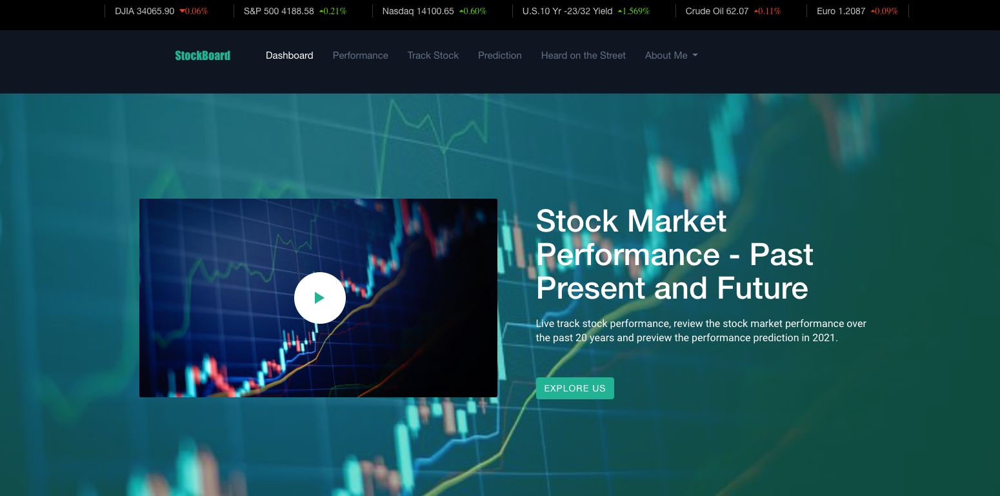
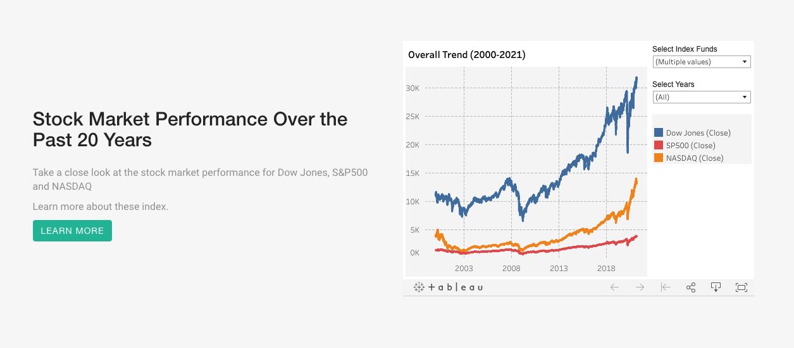
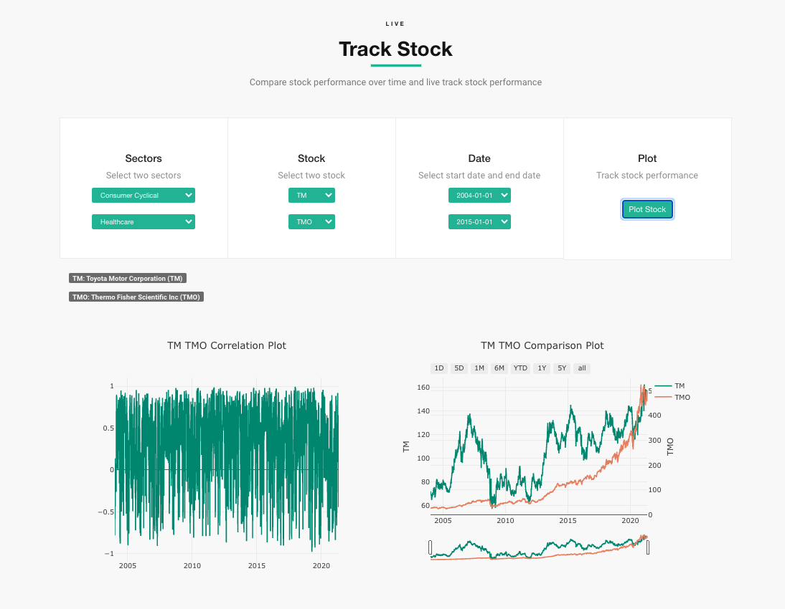
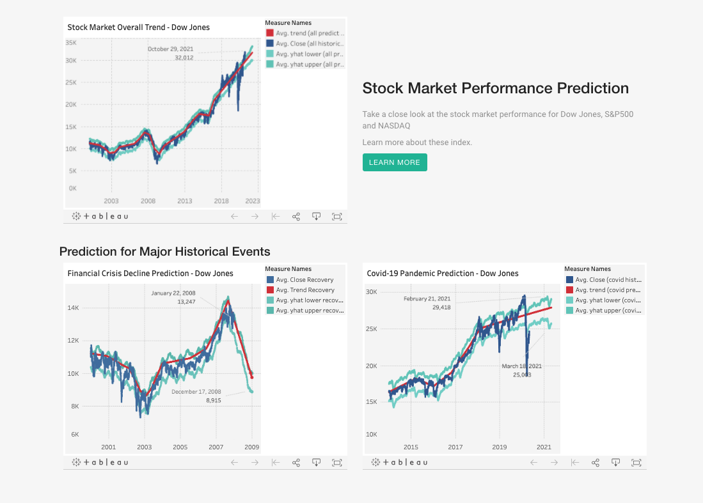
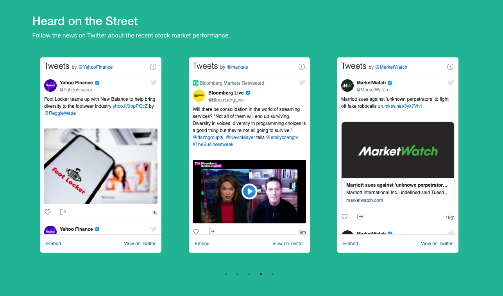

# Interactive-Dashboard

The StockBoard is an interactive dashboard that provides users insights into the stock market performance in the past, present and future. It also enables users to dynamically select sectors, stock and date range to compare and visualize the stock performance. This project used Javascript to set up dropdown buttons for users to filter data and set parameters. It used Javascript (D3.js) and Plotly to visualize stock performance data. Machine Learning (Facebook Prophet library) is incorporated to predict stock market performance in the next 365 days and Tableau is used to visualize the prediction data. The data analytics and visualizations were hosted in a responsive website (built by using HTML, Bootstrap and CSS) that was deployed in Heroku. Other skills and techniques involved in this project include: Python (analyzing data), Flask (rendering HTML template), the AWS cloud database (data migration). 

- Role: data engineer, data analyst, frontend web developer
- Tools: Javascript, HTML, Bootstrap, CSS, Plotly, Flask, Python, AWS, MySQL workbench
- Interactive Dashboard: https://stockboardviz.herokuapp.com/ 

## Steps
1. Used Python to load, clean and organize stock market data
2. Used Tableau to visualize data
   - 
   
3. Used Javascript to set up dropdown buttons for users to filter data and set parameters
4. Used Javascript (D3.js) and Plotly to visualize stock performance data
   - 
   
5. Used Machine Learning (Facebook Prophet library) to predict stock market performance in the next 365 days
6. Tableau is used to visualize the prediction data.
   - 

7. Used Slick Carousel to display the most recent twitter posts from selected accounts
   - 
